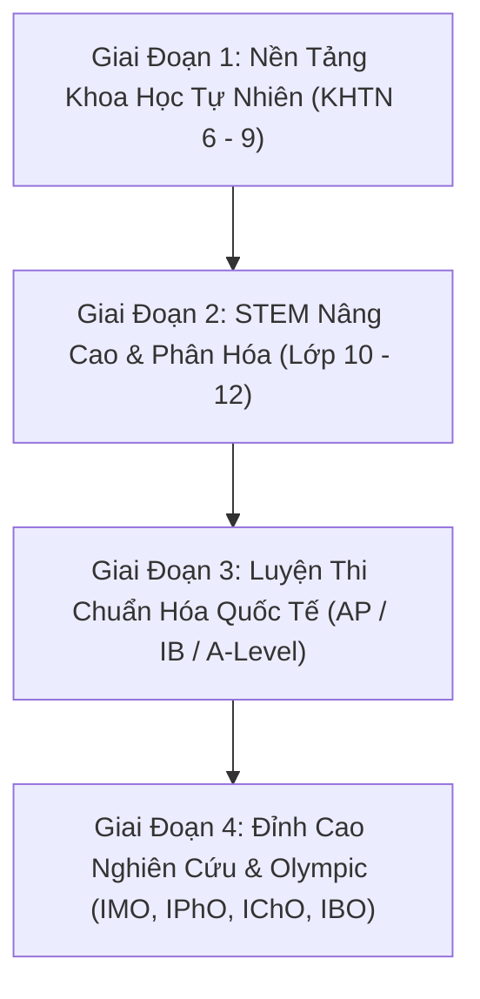

# 🗺️ LỘ TRÌNH CHINH PHỤC STEM TOÀN DIỆN (AISTEM MASTERY ROADMAP)

Để học tốt **STEM (Khoa học - Công nghệ - Kỹ thuật - Toán học)**, phương pháp hiệu quả nhất theo các tiêu chuẩn quốc tế (MIT, Cambridge, Caltech) là **Tam Giác Vàng STEM**:
1. **Lý thuyết & Khái niệm (Concepts & Laws)**: Hiểu bản chất các quy luật khoa học thay vì học vẹt công thức.
2. **Tính toán & Đại số (CAS & Derivation)**: Sử dụng máy tính biểu tượng để chứng minh, suy luận logic từng bước.
3. **Thực nghiệm & Mô hình hóa (Virtual Lab & Observation)**: Trực quan hóa thí nghiệm, kéo thả biến số để thấy kết quả thực tế.

---

## 🧭 CÁC GIAI ĐOẠN TRONG ROADMAP

---

### 📍 Giai Đoạn 1: Nền Tảng Khoa Học Tự Nhiên & Toán Nền (Lớp 6 – 9 / THCS)
* **Mục tiêu**: Hình thành tư duy định lượng, làm quen với đo lường thực tế và các hiện tượng tự nhiên xung quanh.
* **Các chủ đề nòng cốt**:
  - 📐 **Toán**: Đại số cơ bản, Phương trình bậc nhất, Định lý Pytago, Tam giác đồng dạng, Xác suất thống kê sơ cấp.
  - ⚡ **Vật lý**: Đo lường ($D = \frac{m}{V}$), Áp suất chất lưu ($p = d \cdot h$), Đòn bẩy & Ròng rọc, Định luật Ohm cơ bản ($I = \frac{U}{R}$).
  - 🧪 **Hóa học**: Nguyên tử & Phân tử, Phản ứng hóa học cơ bản, Pha chế dung dịch ($C_M = \frac{n}{V}$), Điều chế khí Oxy đẩy nước.
  - 🧬 **Sinh học**: Tế bào học, Cấu tạo cơ thể người, Quang hợp và hô hấp thực vật qua tiêu bản kính hiển vi.
* **Công cụ AISTEM tương ứng**:
  - Sử dụng **Kho Mẫu Vật & Kính Hiển Vi 1000x** để soi tế bào biểu bì hành tây, tế bào máu, vi khuẩn.
  - Trạm thí nghiệm **Mạch Điện DC** và **Nhiệt phân KMnO₄ đẩy nước** trong **STEM Lab Hub**.

---

### 📍 Giai Đoạn 2: STEM Nâng Cao & Động Học Hệ Thống (Lớp 10 – 12 / THPT)
* **Mục tiêu**: Làm chủ các công cụ giải tích toán học và định luật bảo toàn chi phối tự nhiên.
* **Các chủ đề nòng cốt**:
  - 📐 **Toán**: Đạo hàm ($f'(x)$), Nguyên hàm & Tích phân ($\int$), Hình học không gian tọa độ $Oxyz$, Tổ hợp & Nhị thức Newton.
  - ⚡ **Vật lý**: Động học chất điểm, Các định luật Newton ($F = ma$), Bảo toàn cơ năng ($E = E_k + E_p$), Sóng cơ & Sóng ánh sáng (Giao thoa Young).
  - 🧪 **Hóa học**: Cấu hình electron, Bảng tuần hoàn, Chuẩn độ axit-bazơ & pH logarit, Pin điện hóa Daniell (Suất điện động $1.10\text{ V}$), Hóa học hữu cơ (Ankan, Ancol, Este).
  - 🧬 **Sinh học**: Cấu trúc ADN/ARN kép, Cơ chế sao chép và dịch mã chuỗi peptide, Di truyền Menđen và xác suất phả hệ.
* **Công cụ AISTEM tương ứng**:
  - Dùng **Live CAS Calculator** trong chi tiết công thức để giải phương trình và rút ẩn.
  - Trạm **Quang Hình Học Thấu Kính** (kéo thả vật sáng $AB$), **Con Lắc Đơn Bảo Toàn Cơ Năng**, và **Giao Thoa Khe Young**.
  - **Studio Hóa Học 3D**: Khảo sát phân tử không gian IUPAC và mạng tinh thể ion $NaCl$.

---

### 📍 Giai Đoạn 3: Luyện Thi Chuẩn Hóa Quốc Tế (AP, IB, A-Level, SAT/ACT)
* **Mục tiêu**: Rèn luyện kỹ năng giải đề tốc độ cao, khả năng mô hình hóa toán học các bài toán thực tiễn.
* **Các bài thi trọng điểm trên hệ thống**:
  - 🇺🇸 **AP**: AP Calculus AB/BC, AP Physics C (Mechanics & E/M), AP Chemistry, AP Biology.
  - 🌍 **IB / A-Level**: IB Mathematics Analysis & Approaches (AA HL), A-Level Further Mathematics.
  - 🎓 **Đại học Mỹ**: SAT Math (Digital SAT), ACT Math.
* **Chiến thuật hành động trên AISTEM**:
  1. Vào tab **Đấu Trường & Luyện Thi (Arena)** $\rightarrow$ Chọn mục *"Danh Sách Kỳ Thi"*.
  2. Luyện các câu hỏi có chia dạng chi tiết và bấm nút **"Kiểm tra kết quả"**.
  3. Đọc kỹ phần **Lời giải phân tích từng bước (Step-by-step)** kết hợp với gợi ý vào **STEM Lab** khi làm sai.

---

### 📍 Giai Đoạn 4: Đỉnh Cao Nghiên Cứu & Chuyên Sâu (Olympiad & Đại Học)
* **Mục tiêu**: Giải quyết các bài toán biên phức tạp, phân tích ma trận nhiều chiều và động học lượng tử.
* **Các chủ đề nâng cao**:
  - Đại số tuyến tính: Không gian vectơ, Trị riêng & Vectơ riêng ($\det(A - \lambda I) = 0$).
  - Chuỗi Fourier điều hòa: Khai triển hàm tuần hoàn phức tạp thành tổng các hàm sin/cos.
  - Tinh thể học & Hóa lượng tử: Cấu trúc Protein PDB từ RCSB, thuyết Orbital lai hóa VSEPR.
* **Công cụ AISTEM tương ứng**:
  - **Studio Vectơ & Đấu Trường Dựng Hình Euclid**.
  - **Toán Học Trực Quan Cao Cấp (Fourier & Eigen Engine)**.

---

## 💡 LỜI KHUYÊN HỌC STEM HÀNG NGÀY TRÊN AISTEM:

1. **Nguyên tắc "1 Công thức - 1 Phép tính - 1 Thí nghiệm"**:
   - Khi học một công thức mới (ví dụ: *Định luật Ohm $I = U/R$*):
   - Hãy nhập số vào **Live CAS Calculator** để hiểu sự thay đổi tỉ lệ thuận/nghịch.
   - Sau đó mở **STEM Lab Hub** đóng ngắt khóa K để nhìn thấy dòng electron sáng lên thực tế.
2. **Học qua lỗi sai (Mistake-Driven Learning)**:
   - Khi làm bài tập trên hệ thống bị sai, đừng vội xem đáp án. Hãy bấm vào nút gợi ý **"Mở Phòng Thí Nghiệm Liên Quan"** để tự tay kiểm chứng lại hiện tượng, từ đó ghi nhớ vĩnh viễn bản chất vấn đề.
3. **Mục tiêu Chinh phục Học bổng Toàn phần & Đấu trường Quốc tế**:
   - Tham khảo cẩm nang chi tiết tại [docs/scholarship-hunting-guide/](docs/scholarship-hunting-guide/README.md) để lên kế hoạch xây dựng hồ sơ "Spike Profile" săn học bổng $100\%$ đại học Mỹ, Singapore, Nhật, Hàn, Châu Âu và Việt Nam.
   - Tham khảo kho đề thi và cấu trúc bài thi tại [docs/stem-competitions-and-exams/](docs/stem-competitions-and-exams/README.md) (IMO, IPhO, IChO, IBO, AMC/AIME, F=ma, ISEF).

