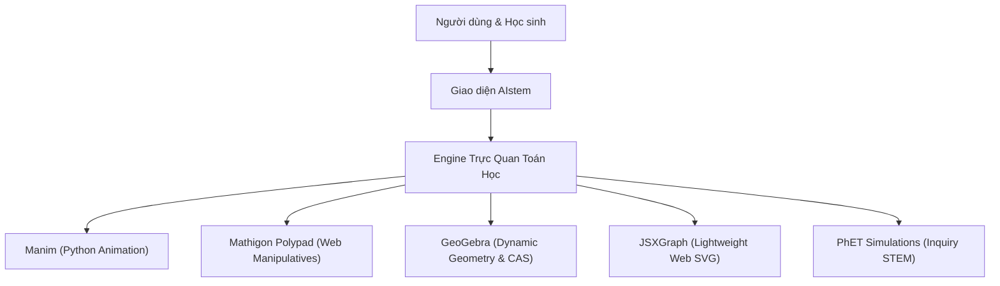

# 🏆 CHUYÊN ĐỀ 3: KHẢO SÁT CÁC DỰ ÁN TOÁN HỌC MÃ NGUỒN MỞ HÀNG ĐẦU THẾ GIỚI

Tài liệu này nghiên cứu, phân tích kiến trúc phần mềm, công nghệ cốt lõi và bài học áp dụng từ các dự án toán học mã nguồn mở xuất sắc nhất trên thế giới để định hình hệ thống **AIstem**.

---

## 1. HỆ SINH THÁI HOẠT HỌA & TRỰC QUAN HÓA TOÁN HỌC (VISUALIZATION ENGINES)



---

### 1.1. Manim (Mathematical Animation Engine)
- **Tác giả & Xuất xứ**: Grant Sanderson (Kênh YouTube **3Blue1Brown**), hiện được bảo trì bởi **Manim Community**.
- **Công nghệ**: Python, Cairo/OpenGL, ModernGL, LaTeX, FFmpeg.
- **Kiến trúc cốt lõi**:
  - `Mobject` (Mathematical Object): Lớp cơ sở đại diện cho mọi đối tượng hiển thị (vectơ, đa giác, đồ thị hàm, chuỗi công thức TeX).
  - `VMobject` (Vectorized Mobject): Chuyển đổi mọi hình dạng và ký tự toán học thành các đường cong Bézier bậc 3 để nội suy hình học.
  - `Transform(mobj1, mobj2)`: Thuật toán biến hình mềm (morphing) giữa hai công thức toán học hoặc hai đồ thị bằng cách dịch chuyển tọa độ các điểm mút Bézier tương ứng.
- **Điểm đột phá**: Chất lượng đồ họa chuẩn điện ảnh (cinematic math), giải thích trực giác bản chất trừu tượng của Đại số tuyến tính, Giải tích vi tích phân, và Mạng nơ-ron.
- **Ứng dụng cho AIstem**:
  - Áp dụng nguyên lý biến hình công thức toán học từng bước: khi học sinh biến đổi $x^2 - 4 = 0 \to (x-2)(x+2) = 0$, ký tự chuyển động mượt mà thay vì nhảy cóc.
  - Sử dụng cơ chế vector Bézier để vẽ các đồ thị hàm mượt mà 60fps trên Canvas.

---

### 1.2. Mathigon & Polypad
- **Tổ chức**: Mathigon (thành lập bởi Philipp Legner, được tập đoàn giáo dục Amplify mua lại và mở mã nguồn mở thư viện **Polypad**).
- **Công nghệ**: TypeScript, SVG/HTML5 Canvas, Custom Web Components, PWA.
- **Kiến trúc cốt lõi**:
  - **Visual Manipulatives Canvas**: Hệ thống các vật thể toán học số hóa có thể cầm nắm, kéo thả:
    - *Polygon & Tangram*: Lắp ghép hình học, đo góc tự động.
    - *Fraction Bars & Prime Factor Circles*: Thẻ phân số ghép đôi và vòng tròn phân tích thừa số nguyên tố đầy màu sắc.
    - *Algebra Tiles*: Ô gạch đại số mô hình hóa đa thức $x^2 + 3x + 2$.
    - *Logic Gates & Graph Theory*: Cổng logic và đồ thị mạng tương tác.
- **Điểm đột phá**: Trải nghiệm cảm ứng đa điểm tuyệt vời, biến toán học trừu tượng thành trò chơi tương tác xúc giác (tactile learning).
- **Ứng dụng cho AIstem**:
  - Tích hợp triết lý "vật thể toán học tương tác" vào các bài giảng lý thuyết trong `docs/lessons/math.md`.
  - Thiết kế các module giải đố đại số và hình học trực quan thay vì chỉ giải bài tập văn bản thuần túy.

---

### 1.3. GeoGebra
- **Tác giả**: Markus Hohenwarter (Đại học Salzburg / Linz).
- **Công nghệ**: Java (bản Desktop) chuyển dịch sang WebAssembly & JavaScript (Web), sử dụng engine đại số máy tính **Giac / Xcas**.
- **Kiến trúc cốt lõi**:
  - **Ràng buộc hình học động (Dynamic Geometric Constraints)**: Cho phép định nghĩa quan hệ phụ thuộc chặt chẽ giữa các đối tượng (ví dụ: điểm $C$ luôn là trung điểm của đoạn thẳng $AB$; khi kéo điểm $A$, điểm $C$ tự động cập nhật tọa độ).
  - **Góc nhìn đa chiều (Dual-View)**: Một bên là cửa sổ đại số (Algebra View chứa phương trình $y = ax^2 + bx + c$), một bên là cửa sổ hình học (Graphics View); chỉnh sửa một bên lập tức cập nhật bên còn lại.
- **Điểm đột phá**: Hệ sinh thái khổng lồ với hơn 1 triệu tài nguyên giáo dục mở, công cụ tiêu chuẩn cho các kỳ thi chuẩn hóa quốc tế.
- **Ứng dụng cho AIstem**:
  - Đã được AIstem ứng dụng trực tiếp trong `GeometryPuzzleArenaView.tsx` (kiểm tra giao điểm, khoảng cách, tính chất tam giác đều, đường trung trực).

---

### 1.4. JSXGraph
- **Tổ chức**: Đại học Bayreuth (Đức).
- **Công nghệ**: Thuần JavaScript, không phụ thuộc bất kỳ thư viện ngoài nào (Zero-dependency), dung lượng nén chỉ ~200KB.
- **Kiến trúc cốt lõi**:
  - Render đa nền tảng linh hoạt trên SVG, HTML5 Canvas hoặc VML.
  - Tối ưu hóa cực đại cho thiết bị di động cấu hình yếu.
  - Hỗ trợ đầy đủ giải tích hàm số, đồ thị 2D, đường cong tham số, trường vectơ đạo hàm (slope fields), chuỗi Fourier.
- **Ứng dụng cho AIstem**:
  - Thích hợp để nhúng đồ thị động siêu nhẹ vào các trang tra cứu công thức nhanh (`FormulasView.tsx`) mà không gây nặng trang web.

---

## 2. HỆ THỐNG ĐIỆN TOÁN BIỂU TƯỢNG (COMPUTER ALGEBRA SYSTEMS - CAS)

```
                            ┌────────────────────────────────┐
                            │    Đề bài Toán (LaTeX / Text)  │
                            └───────────────┬────────────────┘
                                            │
                                  Parse AST biểu thức
                                            │
                    ┌───────────────────────┴───────────────────────┐
                    ▼                                               ▼
     ┌───────────────────────────────┐               ┌───────────────────────────────┐
     │      SymPy Engine (Python)    │               │       Math.js Engine (Web)    │
     │  - Đạo hàm, tích phân giải tích│               │  - Đánh giá biểu thức Client  │
     │  - Ma trận biểu tượng         │               │  - Rút ẩn nhanh trên Browser  │
     │  - Kiểm chứng lời giải độc lập│               │  - Ma trận số phức 2D/3D      │
     └───────────────────────────────┘               └───────────────────────────────┘
```

### 2.1. SymPy (Python)
- **Đặc điểm**: Thư viện CAS hoàn toàn bằng Python, mã nguồn mở giấy phép BSD.
- **Tính năng chủ lực**:
  - Khảo sát hàm số, tìm cực trị, điểm uốn.
  - Tính nguyên hàm & tích phân xác định bằng giải thuật Risch.
  - Khai triển chuỗi Taylor / Laurent.
  - Giải hệ phương trình phi tuyến và phương trình vi phân bằng hàm `dsolve()`.
- **Vai trò tại AIstem**:
  - Đang là hạt nhân kiểm chứng tính đúng đắn độc lập của lời giải tại `engine/` (`aistem/verify.py` & `engine/server.py`). SymPy bảo đảm kết quả trả về từ AI không bị ảo giác số học.

### 2.2. Math.js (JavaScript / TypeScript)
- **Đặc điểm**: Thư viện toán học mở rộng chạy trực tiếp trên Node.js và trình duyệt web.
- **Tính năng chủ lực**:
  - Bộ phân tích cú pháp biểu thức an toàn (`math.evaluate('2 * x + 3', { x: 5 })`).
  - Hỗ trợ số phức, phân số chính xác (BigNumber / Fraction), đơn vị đo lường vật lý ($5\text{ cm} + 2\text{ inch}$).
  - Đạo hàm biểu tượng tự động (`math.derivative('x^2 + 3*x', 'x')`).
- **Vai trò tại AIstem**:
  - Cung cấp khả năng tính toán tức thời (Zero-latency Live CAS) ngay trên trình duyệt trong các modal chi tiết công thức mà không cần gửi request về server Python.

---

## 3. CHỨNG MINH HÌNH THỨC & SỐ HÓA TOÁN HỌC (FORMAL PROOF ENGINES)

### 3.1. Lean 4 & Thư Viện Mathlib
- **Tổ chức**: Microsoft Research & Hiệp hội Toán học Quốc tế (dẫn đầu bởi Leonardo de Moura, Terence Tao, Kevin Buzzard).
- **Bản chất**: Ngôn ngữ lập trình hàm thuần túy và Hệ thống hỗ trợ chứng minh định lý tương tác (Interactive Theorem Prover - ITP).
- **Nguyên lý Curry-Howard**:
  - Một định lý toán học tương ứng với một **Kiểu dữ liệu (Type)**.
  - Một chứng minh cho định lý đó tương ứng với một **Chương trình (Program/Term)** thỏa mãn kiểu dữ liệu đó.
  - Trình biên dịch Lean 4 kiểm tra tính đúng đắn tuyệt đối của chứng minh thông qua cơ chế type checking của máy tính, loại bỏ hoàn toàn khả năng có lỗ hổng logic.
- **Tầm nhìn tương lai cho AIstem**:
  - Số hóa các bài toán Olympic (IMO) và chứng minh hình học phẳng thành các chuỗi bước suy luận hình thức, giúp hệ sinh thái AIstem có khả năng tự động thẩm định bài làm của học sinh ở mức độ học sinh giỏi quốc gia và quốc tế.

---

## 4. BẢNG SO SÁNH CÁC DỰ ÁN VÀ ĐỀ XUẤT ÁP DỤNG VÀO AISTEM

| Dự án | Ngôn ngữ | Giấy phép | Điểm mạnh nhất | Bài học ứng dụng cho AIstem |
|---|---|---|---|---|
| **Manim** | Python | MIT | Hoạt họa toán học điện ảnh | Morphing công thức LaTeX và trực quan hóa đại số tuyến tính |
| **Mathigon Polypad** | TypeScript | GPL / Open Core | Vật thể toán học tương tác trực quan | Thiết kế trạm thao tác khối hình và ô gạch đại số |
| **GeoGebra** | Java / JS | Không thương mại (Giac: GPL) | Hệ thống hình học động & CAS hoàn thiện | Ràng buộc dựng hình compa thước kẻ trong Geometry Arena |
| **JSXGraph** | JavaScript | LGPL / Apache | Siêu nhẹ, zero-dependency, chạy mượt mọi thiết bị | Nhúng đồ thị động vào bài học Markdown và bảng tra cứu |
| **SymPy** | Python | BSD | Điện toán biểu tượng toàn diện | Hạt nhân kiểm chứng lời giải chống ảo giác ở Backend |
| **Math.js** | TypeScript | Apache-2.0 | Tính toán biểu tượng tức thời trên Client | Live CAS Calculator trực tiếp trong giao diện Web |
| **Lean 4** | Lean / C++ | Apache-2.0 | Kiểm chứng suy luận hình thức 100% | Định hướng thẩm định logic giải toán Olympic tự động |
