# 🎓 CẨM NANG & KẾ HOẠCH SĂN HỌC BỔNG TOÀN CẦU (AISTEM SCHOLARSHIP ROADMAP)

Bộ tài liệu này cung cấp bản đồ toàn diện về các chương trình học bổng danh giá nhất thế giới (Mỹ, Singapore, Nhật Bản, Hàn Quốc, Châu Âu, Úc và Việt Nam), tiêu chí tuyển chọn, kiến trúc hồ sơ 4 chân kiềng, và lộ trình từng bước (timeline) để chinh phục học bổng toàn phần (Full-ride / 100%).

---

## 🧭 CẤU TRÚC BỘ TÀI LIỆU SĂN HỌC BỔNG

```
docs/scholarship-hunting-guide/
├── README.md                                    # Bản đồ tổng quan, phân loại học bổng & lộ trình 3 năm
├── 01-HOC-BONG-MY-VA-CANADA.md                 # Ivy League (Need-based), Stamps, Morehead-Cain, Lester B. Pearson
├── 02-HOC-BONG-CHAU-A-SINGAPORE-NHAT-HAN.md    # ASEAN/NUS/NTU (Sing), MEXT (Nhật), GKS & KAIST STEM (Hàn)
├── 03-HOC-BONG-CHAU-AU-UC-NEW-ZEALAND.md       # Jardine/Chevening (UK), DAAD (Đức), Eiffel (Pháp), Go8 (Úc)
├── 04-HOC-BONG-VIET-NAM-VINUNI-RMIT-FULBRIGHT.md# VinUniversity, RMIT Vietnam, Fulbright Vietnam
└── 05-CHIEN-LUOC-HO-SO-VA-BAI-LUAN.md          # Xây dựng Spike Profile, viết luận cá nhân & phỏng vấn
```

---

## 🏛️ PHÂN LOẠI CÁC LOẠI HÌNH HỌC BỔNG QUỐC TẾ

```mermaid
graph TD
    Scholarships["HỆ THỐNG HỌC BỔNG"] --> NeedBased["1. Need-Based Aid (Theo nhu cầu tài chính)"]
    Scholarships --> MeritBased["2. Merit-Based Scholarship (Theo thành tích xuất sắc)"]
    Scholarships --> GovBased["3. Government Scholarships (Học bổng Chính phủ)"]
    Scholarships --> CompBased["4. Competition-Linked (Gắn liền với giải thi đấu)"]

    NeedBased --> NeedBlind["Need-Blind (Harvard, MIT, Princeton, Yale, Amherst, Bowdoin, Dartmouth)"]
    NeedBased --> NeedAware["Need-Aware (Phần lớn các trường ĐH Mỹ & Canada)"]

    MeritBased --> FullRide["Full-Ride: 100% Học phí + Ký túc xá + Sinh hoạt phí + Bảo hiểm"]
    MeritBased --> FullTuition["Full-Tuition: 100% Học phí"]

    GovBased --> SingGov["ASEAN Scholarship (Singapore MOE)"]
    GovBased --> JapanGov["MEXT (Chính phủ Nhật Bản)"]
    GovBased --> KoreaGov["GKS / KGSP (Chính phủ Hàn Quốc)"]
    GovBased --> UKGov["Chevening / Jardine (Vương quốc Anh)"]
    GovBased --> AusGov["Australia Awards (Chính phủ Úc)"]

    CompBased --> OlympiadWin["Giải thưởng Olympic Quốc tế (IMO, IPhO, IChO, IBO, IOI)"]
    CompBased --> ScienceFairWin["Giải thưởng ISEF / ViSEF (Nghiên cứu KHKT)"]
```



---

## 🎯 HỒ SƠ 4 CHÂN KIỀNG ĐỂ SĂN HỌC BỔNG TOP 1% THẾ GIỚI

Để nhận được học bổng cạnh tranh cao ($50,000 – $90,000/\text{năm}$), hồ sơ của bạn phải thể hiện sự vượt trội và hài hòa ở cả 4 trụ cột:

```
┌─────────────────────────────────────────────────────────────────────────┐
│                        HỒ SƠ 4 CHÂN KIỀNG (THE 4 PILLARS)               │
├────────────────────────────────────┬────────────────────────────────────┤
│ 1. HỌC THUẬT & ĐIỂM CHUẨN HÓA      │ 2. GIẢI THƯỞNG HỌC THUẬT & STEM   │
│ - GPA: ≥ 9.0/10 hoặc ≥ 3.85/4.0    │ - Giải HSG Quốc gia / Tỉnh        │
│ - SAT: ≥ 1500/1600 (EBRW 700+, M800)│ - Giải Olympic (AMC, AIME, F=ma)  │
│ - IELTS: ≥ 7.5 – 8.0 (hoặc TOEFL)  │ - Giải Nghiên cứu KHKT (ISEF/ViSEF)│
│ - AP: 4–5 môn đạt điểm 5 tuyệt đối │ - Giải Robotics / Hackathon       │
├────────────────────────────────────┼────────────────────────────────────┤
│ 3. HOẠT ĐỘNG & DỰ ÁN CÁ NHÂN       │ 4. BÀI LUẬN & THƯ GIỚI THIỆU       │
│ - Mũi nhọn (Spike): Dự án liên tục │ - Personal Statement truyền cảm    │
│ - Leadership: Khởi xướng & dẫn dắt │   hứng, phản ánh thế giới quan sâu │
│ - Tác động cộng đồng (Impact)      │ - Thư giới thiệu (LOR) từ thầy cô  │
│ - Bằng chứng thực tế (Github/Paper)│   hiểu sâu sắc về năng lực & nhân cách│
└────────────────────────────────────┴────────────────────────────────────┘
```

---

## 📅 LỘ TRÌNH 3 NĂM SĂN HỌC BỔNG TOÀN DIỆN (LỚP 10 – 12)

### 📍 NĂM LỚP 10: XÂY DỰNG NỀN MÓNG & ĐỊNH HÌNH MŨI NHỌN (SPIKE)
- **Học thuật**: Giữ GPA lớp 10 thật cao ($\ge 9.2$). Đọc sách chuyên ngành tiếng Anh để mở rộng vốn từ.
- **Chứng chỉ ngoại ngữ**: Ôn luyện và thi đạt IELTS $\ge 7.0$ hoặc TOEFL iBT $\ge 95$.
- **Thử sức cuộc thi**: Tham gia các kỳ thi kiểm tra năng lực tư duy như AMC 10, Kangaroo Math, SASMO, Bebras.
- **Hoạt động ngoại khóa**: Tham gia 2–3 câu lạc bộ chuyên môn (CLB Khoa học STEM, CLB Lập trình, CLB Tranh biện). Tìm kiếm đề tài cho cuộc thi Khoa học Kỹ thuật (ViSEF).

### 📍 NĂM LỚP 11: BỨT PHÁ GIẢI THƯỞNG & CHỨNG CHỈ QUỐC TẾ (NĂM BẢN LỀ)
- **Kỳ 1 (Tháng 9 – 12)**:
  - Ôn luyện chuyên sâu và thi **Digital SAT** (mục tiêu $\ge 1500$, trong đó Math đạt 780–800).
  - Tham gia vòng loại HSG Quốc gia, kỳ thi F=ma Contest (Vật lý), AMC 12 và AIME (Toán).
- **Kỳ 2 (Tháng 1 – 5)**:
  - Hoàn thiện đề tài nghiên cứu KHKT ViSEF / tham gia cuộc thi sáng tạo STEM / Robotics.
  - Ôn thi các môn **AP (Advanced Placement)** vào tháng 5: AP Calculus BC, AP Physics C, AP Chemistry hoặc AP Computer Science A.
- **Mùa hè (Tháng 6 – 8)**:
  - Tham gia trại hè khoa học uy tín, chương trình nghiên cứu cùng giáo sư đại học hoặc tự viết bài báo khoa học.
  - Lên danh sách trường mục tiêu (School List chia thành: *Reach - Target - Safety*).
  - Lên dàn ý và viết nháp các bài luận cá nhân (Personal Statement).

### 📍 NĂM LỚP 12: HOÀN THIỆN HỒ SƠ & NỘP ĐƠN (APPLICATION SEASON)
- **Tháng 8 – 9**: Xin thư giới thiệu (LOR) từ các thầy cô bộ môn và giáo viên chủ nhiệm. Hoàn thiện Common App / UCAS / MEXT application.
- **Tháng 10 – 11**: Nộp đơn các đợt sớm:
  - Mỹ: Early Decision (ED) / Early Action (EA) hạn ngày 1/11.
  - Singapore: Đăng ký xét học bổng NUS / NTU.
- **Tháng 12 – 1**: Nộp đơn các đợt thường (Regular Decision - RD) hạn ngày 1/1 hoặc 15/1. Nộp hồ sơ học bổng chính phủ (MEXT, GKS, DAAD).
- **Tháng 2 – 4**: Tham gia các vòng phỏng vấn học bổng với đại diện trường và cựu sinh viên. Nhận kết quả và so sánh gói hỗ trợ tài chính (*Financial Aid Package*).
- **Tháng 5**: Chốt trường (Commitment) trước ngày 1/5 và làm thủ tục Visa du học.
