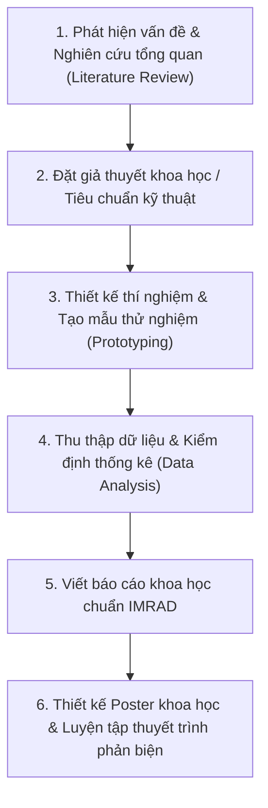

# 🤖 CHUYÊN ĐỀ 5: NGHIÊN CỨU KHOA HỌC KỸ THUẬT STEM & ROBOTICS (REGENERON ISEF, VISEF, VEX/FIRST)

Tài liệu này hướng dẫn chi tiết quy chuẩn nghiên cứu khoa học kỹ thuật, thang điểm đánh giá của ban giám khảo quốc tế và cẩm nang dự án nghiên cứu cho **Regeneron ISEF**, **ViSEF**, và các cuộc thi **Robotics STEM**.

---

## 1. CUỘC THI KHOA HỌC KỸ THUẬT QUỐC TẾ (REGENERON ISEF & VISEF)

### 1.1. Tổng Quan Về ISEF
- **Tổ chức**: Society for Science (Hoa Kỳ).
- **Quy mô**: Cuộc thi nghiên cứu khoa học dành cho học sinh trung học (lớp 9–12) lớn nhất hành tinh, quy tụ gần **1,800 nhà khoa học trẻ** từ hơn 80 quốc gia và vùng lãnh thổ mỗi năm.
- **Cuộc thi cấp quốc gia tại Việt Nam**: **ViSEF** (Cuộc thi Khoa học Kỹ thuật cấp Quốc gia học sinh trung học do Bộ Giáo dục và Đào tạo tổ chức thường niên). Các dự án đạt giải Nhất tại ViSEF sẽ được tuyển chọn vào đội tuyển đại diện Việt Nam tham dự ISEF tại Hoa Kỳ.

---

### 1.2. Thang Điểm Đánh Giá Chuẩn Của Ban Giám Khảo ISEF (100 Điểm)

Ban giám khảo ISEF (gồm các giáo sư, tiến sĩ, chuyên gia đầu ngành) phân loại dự án thành hai nhóm với tiêu chí chấm điểm riêng biệt:

```
                                  TIÊU CHÍ CHẤM ISEF
                                           │
                ┌──────────────────────────┴──────────────────────────┐
                ▼                                                     ▼
     DỰ ÁN KHOA HỌC (SCIENCE)                              DỰ ÁN KỸ THUẬT (ENGINEERING)
  1. Câu hỏi nghiên cứu (10đ)                          1. Xác định vấn đề thực tiễn (10đ)
  2. Thiết kế & Phương pháp luận (15đ)                 2. Xác lập tiêu chuẩn thiết kế (15đ)
  3. Thực thi: Thu thập & Phân tích số liệu (20đ)      3. Chế tạo mẫu thử & Thử nghiệm lặp (20đ)
  4. Tính sáng tạo & Đột phá (20đ)                     4. Tính sáng tạo kỹ thuật (20đ)
  5. Thuyết trình Poster & Phỏng vấn (35đ)             5. Thuyết trình Poster & Phỏng vấn (35đ)
```

#### Chi tiết từng tiêu chí:
1. **Câu hỏi nghiên cứu / Vấn đề thực tiễn (10 điểm)**:
   - Mục tiêu nghiên cứu có rõ ràng, tập trung và có ý nghĩa đóng góp xã hội/khoa học không?
   - Tính mới so với các công trình đã công bố trên thế giới.
2. **Thiết kế & Phương pháp luận (15 điểm)**:
   - Biến số độc lập (Independent), biến số phụ thuộc (Dependent) và biến kiểm soát (Control) có được định nghĩa chặt chẽ không?
   - Cỡ mẫu thực nghiệm có đủ độ tin cậy thống kê không ($N \ge 30$ hoặc lặp lại ít nhất 3 lần)?
3. **Thực thi & Phân tích số liệu (20 điểm)**:
   - Thu thập dữ liệu có hệ thống, khách quan.
   - Ứng dụng thống kê toán học (kiểm định Student's t-test, ANOVA, hệ số tương quan $R^2$) thay vì chỉ tính trung bình đơn giản.
4. **Tính sáng tạo (20 điểm)**:
   - Phương pháp tiếp cận độc đáo, chi phí thấp, hoặc cách thức giải quyết vấn đề vượt trội so với giải pháp hiện có.
5. **Thuyết trình Poster & Phỏng vấn trực tiếp (35 điểm - Quan trọng nhất)**:
   - Học sinh có tự tay làm chủ 100% mã nguồn, thiết kế phần cứng và lập luận không?
   - Khả năng trả lời sắc bén các câu hỏi phản biện chuyên sâu từ giám khảo.

---

### 1.3. 22 Phân Ngành Nghiên Cứu STEM Tại ISEF
1. Hệ thống nhúng (Embedded Systems)
2. Robot và máy thông minh (Robotics and Intelligent Machines)
3. Phần mềm hệ thống & Trí tuệ nhân tạo (Systems Software / AI)
4. Sinh học tính toán và Tin sinh học (Computational Biology and Bioinformatics)
5. Kỹ thuật y sinh (Biomedical Engineering)
6. Khoa học y sinh và sức khỏe (Biomedical and Health Sciences)
7. Hóa sinh (Biochemistry)
8. Sinh học tế bào và phân tử (Cellular and Molecular Biology)
9. Hóa học (Chemistry)
10. Khoa học Trái đất và Môi trường (Earth and Environmental Sciences)
11. Kỹ thuật môi trường (Environmental Engineering)
12. Năng lượng: Vật liệu và Thiết kế bền vững (Energy: Sustainable Materials and Design)
13. Khoa học vật liệu (Materials Science)
14. Toán học (Mathematics)
15. Vật lý và Thiên văn học (Physics and Astronomy)
16. Vi sinh học (Microbiology)
17. Khoa học thực vật (Plant Sciences)
18. Khoa học động vật (Animal Sciences)
19. Khoa học xã hội và hành vi (Behavioral and Social Sciences)
20. Kỹ thuật công nghệ: Tĩnh học và Động lực học (Engineering Technology: Statics and Dynamics)
21. Công nghệ nâng cao nghệ thuật (Technology Enhances the Arts)
22. Khoa học y học chuyển dịch (Translational Medical Science)

---

## 2. CÁC ĐẤU TRƯỜNG ROBOTICS QUỐC TẾ (VEX ROBOTICS & FIRST)

### 2.1. VEX Robotics World Championship
- **Hình thức thi đấu**: Thi đấu đối kháng liên minh trên sân thi chuẩn $12\text{ ft} \times 12\text{ ft}$.
- **Hai hiệp đấu kịch tính**:
  1. **Hiệp tự hành (Autonomous Period - 15 giây)**: Robot hoàn toàn tự động định vị bằng cảm biến thị giác (Vision Sensor), quán tính (IMU) và bộ mã hóa vòng quay (Optical Encoders) theo thuật toán PID và Odometry.
  2. **Hiệp điều khiển tay (Driver Controlled Period - 1 phút 45 giây)**: Đòi hỏi kỹ năng phối hợp chiến thuật đồng đội và độ bền cơ khí.

### 2.2. FIRST Robotics Competition (FRC)
- "Văn hóa kỹ thuật đỉnh cao": Robot cỡ lớn (nặng tới 55kg), sử dụng động cơ công nghiệp, khí nén (Pneumatics), camera thị giác máy tính và giao thức mạng không dây thời gian thực.
- Đề cao tinh thần **"Gracious Professionalism"** (Chuyên nghiệp nhân ái) - cạnh tranh khốc liệt trên sân đấu nhưng luôn sẵn sàng hỗ trợ linh kiện cho đối thủ khi gặp sự cố.

---

## 3. LỘ TRÌNH 6 BƯỚC THỰC HIỆN DỰ ÁN NGHIÊN CỨU STEM CHUẨN QUỐC TẾ



1. **Khảo cứu tài liệu học thuật (Literature Review)**:
   - Tra cứu trên *Google Scholar*, *IEEE Xplore*, *PubMed*, *arXiv* để đảm bảo ý tưởng chưa từng bị ai thực hiện giống hệt.
2. **Cấu trúc báo cáo khoa học chuẩn IMRAD**:
   - **I**ntroduction (Mở đầu): Bối cảnh và câu hỏi nghiên cứu.
   - **M**ethodology (Phương pháp): Chi tiết vật liệu, quy trình để người khác có thể lặp lại (reproducibility).
   - **R**esults (Kết quả): Bảng số liệu, biểu đồ độ lệch chuẩn, ảnh chụp SEM/kính hiển vi.
   - **A**nd **D**iscussion (Thảo luận & Đánh giá): Ý nghĩa kết quả, giới hạn của đề tài và hướng phát triển tương lai.
