# 🏆 HỆ THỐNG CÁC CUỘC THI & BÀI THI STEM TOÀN CẦU (AISTEM COMPETITIONS SUITE)

Bộ tài liệu này cung cấp bức tranh toàn cảnh, cấu trúc đề thi chi tiết, ma trận kiến thức, chiến thuật làm bài và kho đề mẫu có lời giải chuẩn mực cho tất cả các cuộc thi học thuật **STEM (Science - Technology - Engineering - Mathematics)** uy tín hàng đầu tại Việt Nam và trên thế giới.

---

## 🧭 CẤU TRÚC BỘ TÀI LIỆU MARKDOWN

```
docs/stem-competitions-and-exams/
├── README.md                                   # Bản đồ tổng quan, lộ trình & tiêu chí phân loại
├── 01-OLYMPIAD-TOAN-TIN-IMO-AMC.md             # IMO, AMC 8/10/12, AIME, Kangaroo, SASMO, IOI
├── 02-OLYMPIAD-VAT-LI-IPHO-USAPHO.md           # IPhO, APhO, F=ma Contest, USAPhO, VPhO
├── 03-OLYMPIAD-HOA-HOC-ICHO-USNCO.md           # IChO, USNCO, VChO (Lý thuyết & Thực nghiệm)
├── 04-OLYMPIAD-SINH-HOC-IBO-USABO.md           # IBO, USABO, VBO (Lý thuyết & 4 Trạm thực hành)
└── 05-NGHIEN-CUU-KHOA-HOC-STEM-ISEF.md         # Regeneron ISEF, ViSEF, VEX/FIRST Robotics
```

---

## 🗺️ BẢN ĐỒ PHÂN LOẠI CÁC CUỘC THI STEM

```mermaid
graph TD
    STEM["HỆ THỐNG CUỘC THI STEM"] --> Math["1. Toán học & Tin học"]
    STEM --> Physics["2. Vật lý học"]
    STEM --> Chem["3. Hóa học"]
    STEM --> Bio["4. Sinh học"]
    STEM --> Eng["5. Khoa học Kỹ thuật & Robotics"]

    Math --> IMO["IMO (Olympic Toán Quốc tế)"]
    Math --> AMC["AMC 8 / 10 / 12 & AIME (Hoa Kỳ)"]
    Math --> IKMC["Kangaroo Math (IKMC) & SASMO"]
    Math --> IOI["IOI & Bebras (Tin học & Thuật toán)"]

    Physics --> IPhO["IPhO & APhO (Olympic Vật lý)"]
    Physics --> Fma["F=ma Contest & USAPhO (AAPT)"]
    Physics --> VPhO["HSG Quốc gia Vật lý (VPhO)"]

    Chem --> IChO["IChO (Olympic Hóa học Quốc tế)"]
    Chem --> USNCO["USNCO (ACS Hoa Kỳ)"]
    Chem --> VChO["HSG Quốc gia Hóa học (VChO)"]

    Bio --> IBO["IBO (Olympic Sinh học Quốc tế)"]
    Bio --> USABO["USABO (CEE Hoa Kỳ)"]
    Bio --> VBO["HSG Quốc gia Sinh học (VBO)"]

    Eng --> ISEF["Regeneron ISEF & ViSEF (KHKT Quốc tế)"]
    Eng --> Robo["FIRST Robotics & VEX Robotics"]
```



---

## 📊 BẢNG TỔNG HỢP CÁC KỲ THI STEM THEO LỨA TUỔI VÀ ĐỘ KHÓ

| Kỳ thi | Đơn vị tổ chức | Lứa tuổi / Cấp | Thời gian thi | Hình thức bài thi | Trọng số kiến thức |
|---|---|---|---|---|---|
| **Kangaroo (IKMC)** | AKSF Quốc tế | Lớp 1 – 12 | 75 phút | 24–30 câu trắc nghiệm | Toán ứng dụng, tư duy trực giác, logic hình ảnh |
| **SASMO** | SIMCC Singapore | Lớp 2 – 12 | 90 phút | 25 câu (15 trắc nghiệm + 10 điền số) | Số học, hình học, quy luật dãy số |
| **AMC 8** | MAA (Hoa Kỳ) | Lớp 8 trở xuống | 40 phút | 25 câu trắc nghiệm 5 lựa chọn | Đại số sơ cấp, hình học phẳng, tổ hợp, số học |
| **AMC 10 / 12** | MAA (Hoa Kỳ) | Lớp 10 / 12 trở xuống | 75 phút | 25 câu trắc nghiệm (150 điểm tối đa) | Tiền giải tích, lượng giác, số phức, tổ hợp sâu |
| **AIME** | MAA (Hoa Kỳ) | Top thí sinh AMC | 3 giờ | 15 câu điền số nguyên (000 – 999) | Toán giải đố chuyên sâu, biến đổi đại số phức tạp |
| **F=ma Contest** | AAPT (Hoa Kỳ) | THPT (Lớp 9–12) | 75 phút | 25 câu trắc nghiệm cơ học | 100% Cơ học Newton, bảo toàn năng lượng, sóng, chất lưu |
| **USAPhO** | AAPT (Hoa Kỳ) | Bán kết F=ma | 3 giờ (2 phần) | 6 bài tự luận tự do | Toàn diện: Cơ, Nhiệt, Điện từ, Quang, Lượng tử |
| **USNCO** | ACS (Hoa Kỳ) | THPT (Lớp 9–12) | 3 vòng thi | Trắc nghiệm + Tự luận + Thực hành Lab | Vô cơ, Hữu cơ, Nhiệt động học, Điện hóa, Phân tích |
| **USABO** | CEE (Hoa Kỳ) | THPT (Lớp 9–12) | 50 phút $\to$ 2 giờ | Trắc nghiệm đa lựa chọn $\to$ Lab Test | Sinh học phân tử, Di truyền, Sinh lý học, Tiến hóa |
| **IMO / IPhO / IChO / IBO** | Ủy ban Olympic Quốc tế | Đội tuyển Quốc gia THPT | 2 ngày (mỗi ngày 4.5 – 5 giờ) | Tự luận lý thuyết đỉnh cao + Thực nghiệm Lab | Kiến thức vượt cấp, tư duy đột phá, giải quyết bài toán mở |
| **Regeneron ISEF** | Society for Science | Lớp 9 – 12 | 1 tuần triển lãm | Trình bày poster & phỏng vấn ban giám khảo | Đổi mới sáng tạo, phương pháp luận nghiên cứu, kỹ thuật thực nghiệm |

---

## 🎯 LỘ TRÌNH 4 BƯỚC CHINH PHỤC ĐẤU TRƯỜNG STEM TRÊN AISTEM

1. **Bước 1: Rà soát & Làm chủ Công thức Nền tảng**:
   - Sử dụng kho công thức `data/formulas/` với 5,272 công thức để tra cứu hệ thức chính xác, miền áp dụng và thứ nguyên đo lường.
2. **Bước 2: Luyện tập Từng Bước theo Chủ đề**:
   - Truy cập kho bài tập `data/problems/` với hơn 4,300 bài tập chia theo cấp độ (Cơ bản $\to$ Vận dụng $\to$ Olympic).
   - Kiểm tra đáp án bằng hệ thống chấm điểm tự động và SymPy CAS Verification Engine.
3. **Bước 3: Thực hành Thí nghiệm Ảo & Mô phỏng Trực quan**:
   - Chạy các mô phỏng giải tích RK4 (chuyển động cơ học, dao động phi tuyến), phân tích Fourier sóng âm, hoặc trạm biến đổi ma trận để hiểu sâu sắc bản chất hiện tượng.
4. **Bước 4: Giải Đề Thi Mô Phỏng & Bấm Giờ Thực Chiến**:
   - Đọc kỹ hồ sơ kỳ thi tại `data/exams/` để nắm vững chiến thuật làm bài, các bẫy thường gặp (Common Traps), và phân bổ thời gian hợp lý cho từng phần thi.
