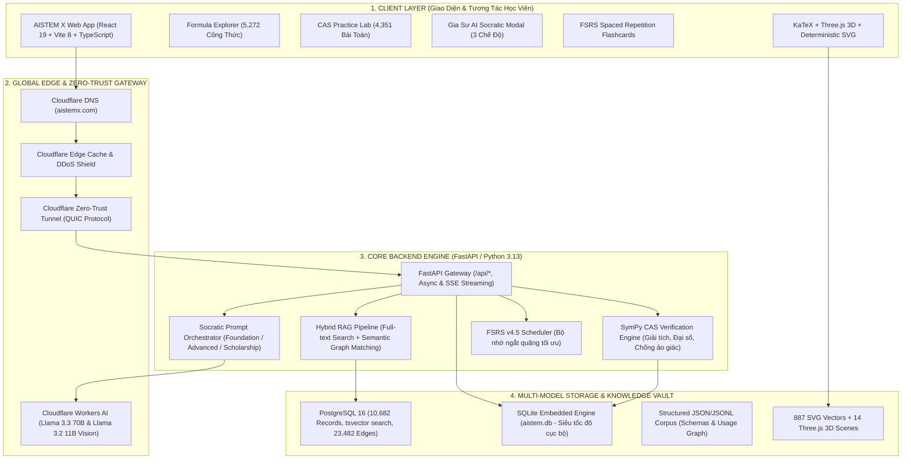
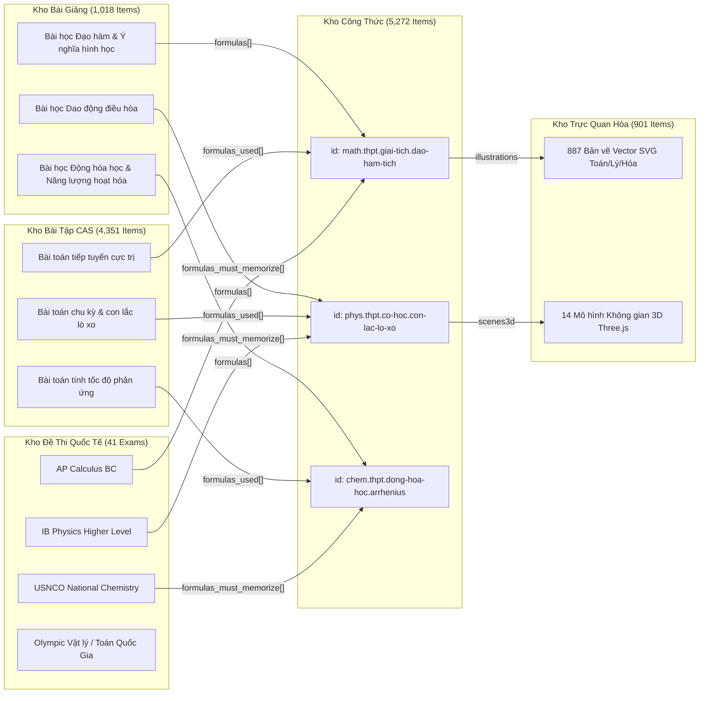
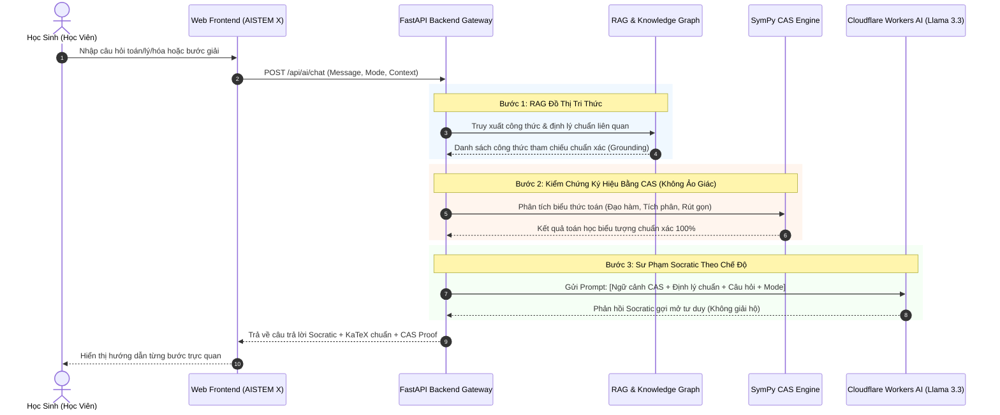
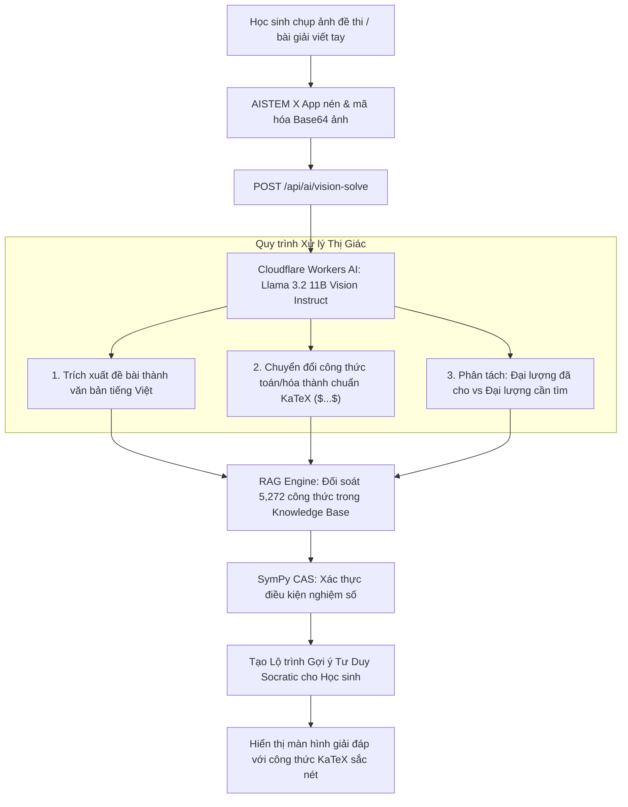
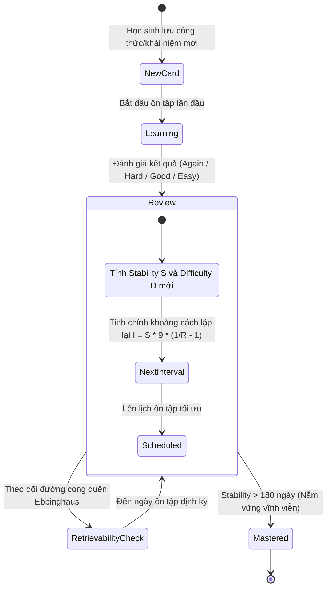
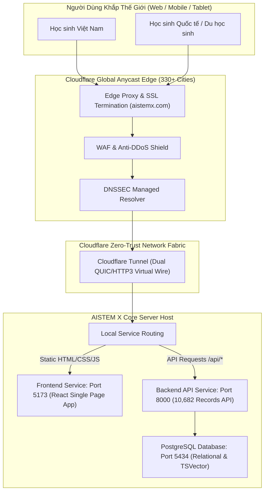

# 🔄 BỘ SƠ ĐỒ LUỒNG HỆ THỐNG & KIẾN TRÚC KỸ THUẬT AISTEM X
**Dự Án**: AISTEM X — Nền tảng Siêu Tri Thức Khoa Học Liên Môn & Gia Sư AI STEM Chuẩn Quốc Tế  
**Tên Miền**: [aistemx.com](https://aistemx.com)  
**Phiên Bản Dự Thi**: 1.0.0 (Production Ready)  

---

## 📑 MỤC LỤC SƠ ĐỒ
1. [Sơ Đồ Kiến Trúc Hệ Thống Tổng Thể (Overall System Architecture)](#1-sơ-đồ-kiến-trúc-hệ-thống-tổng-thể)
2. [Sơ Đồ Luồng Dữ Liệu & Đồ Thị Tri Thức 4 Kho (Knowledge Graph Data Flow)](#2-sơ-đồ-luồng-dữ-liệu--đồ-thị-tri-thức-4-kho)
3. [Luồng Gia Sư AI Socratic & Kiểm Chứng CAS Chống Ảo Giác (Anti-Hallucination Sequence)](#3-luồng-gia-sư-ai-socratic--kiểm-chứng-cas-chống-ảo-giác)
4. [Luồng Nhận Diện Đề Bài Đa Phương Thức (Multimodal Vision Solve Flow)](#4-luồng-nhận-diện-đề-bài-đa-phương-thức)
5. [Luồng Thuật Toán Ghi Nhớ Ngắt Quãng FSRS (Spaced Repetition Flow)](#5-luồng-thuật-toán-ghi-nhớ-ngắt-quãng-fsrs)
6. [Luồng Triển Khai Hạ Tầng Mạng Biên & Zero-Trust (Cloudflare Edge & Local Engine)](#6-luồng-triển-khai-hạ-tầng-mạng-biên--zero-trust)

---

## 1. SƠ ĐỒ KIẾN TRÚC HỆ THỐNG TỔNG THỂ

---

## 2. SƠ ĐỒ LUỒNG DỮ LIỆU & ĐỒ THỊ TRI THỨC 4 KHO

Hệ thống kết nối 4 kho dữ liệu học thuật qua các trường định danh khóa chéo, hình thành một mạng lưới tri thức liên môn (Interdisciplinary Graph):

---

## 3. LUỒNG GIA SƯ AI SOCRATIC & KIỂM CHỨNG CAS CHỐNG ẢO GIÁC

Quy trình giải quyết triệt để vấn đề "ảo giác số liệu" (hallucination) thường gặp của LLM trong toán học và khoa học tự nhiên:

---

## 4. LUỒNG NHẬN DIỆN ĐỀ BÀI ĐA PHƯƠNG THỨC (MULTIMODAL VISION SOLVE)

Cho phép học sinh chụp ảnh đề thi viết tay, biểu đồ hình học hoặc phương trình hóa học phức tạp từ điện thoại/máy tính:

---

## 5. LUỒNG THUẬT TOÁN GHI NHỚ NGẮT QUÃNG FSRS

AISTEM X ứng dụng chuẩn thuật toán **FSRS (Free Spaced Repetition Scheduler)** vượt trội hơn so với SM-2 của Anki, tính toán độ suy giảm trí nhớ dựa trên 3 thông số: Độ khó ($D$), Độ ổn định ($S$), Khả năng nhớ lại ($R$):

---

## 6. LUỒNG TRIỂN KHAI HẠ TẦNG MẠNG BIÊN & ZERO-TRUST

Mô hình triển khai hybrid kết hợp Edge Network toàn cầu với Local Dedicated Server:

---
*Tài liệu được thiết kế chuyên biệt cho hồ sơ kỹ thuật tham dự các cuộc thi Khoa học Kỹ thuật, Sáng tạo Khởi nghiệp & Chuyển đổi số.*
